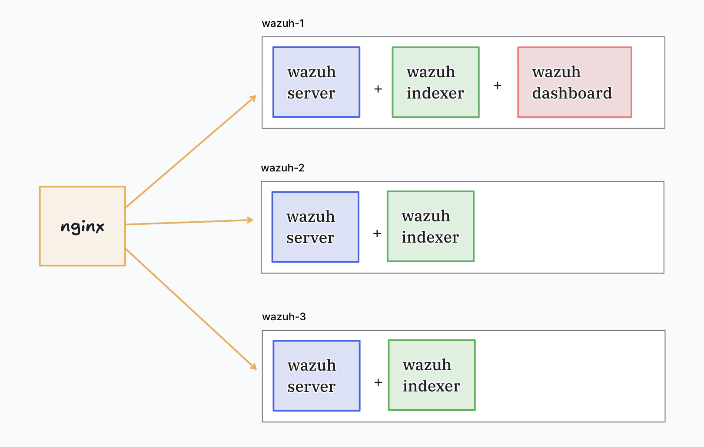
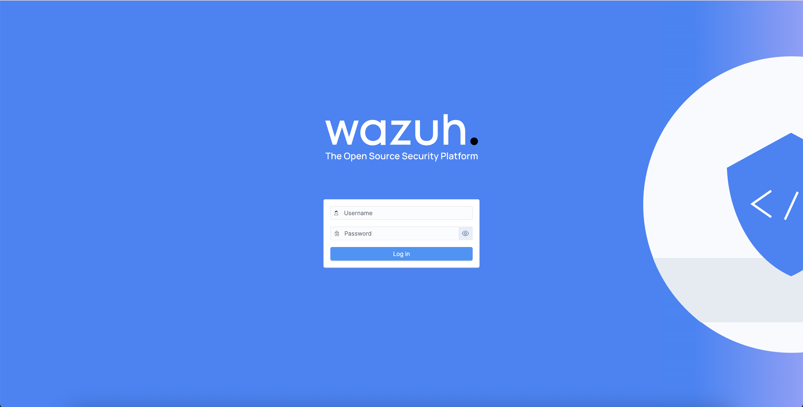

# Cluster Yapıda Wazuh Kurulumu + Nginx

Merhabalar,

Bu yazımda wazuh 'un resmi dökümanlarını referans alarak wazuh cluster yapsının nasıl kurulacağını aktarmaya çalışacağım.
Kurulum için 4 adet ubuntu 24 sunucu kullanacağım.

## Sunucular ve Görevleri

- Server 1 : 192.168.100.100 - Load Balancer (nginx)
- Server 2 : 192.168.100.101 - Wazuh Indexer + Wazuh Server + Wazuh Dashboard (wazuh-1)
- Server 3 : 192.168.100.102 - Wazuh Indexer + Wazuh Server (wazuh-2)
- Server 4 : 192.168.100.103 - Wazuh Indexer + Wazuh Server (wazuh-3)

## Topoloji



---------------------------------------------------------------------------------------------------------------------------------------------------

## Wazuh Indexer (Referans : https://documentation.wazuh.com/current/installation-guide/wazuh-indexer/installation-assistant.html)

Wazuh indexer, yüksek ölçeklenebilirliğe sahip, tam metin arama ve analiz motorudur. 
Bu merkezi bileşen, Wazuh sunucusu tarafından oluşturulan uyarıları indeksler ve depolar.

### Wazuh Indexer Kurulumu (192.168.100.101)

192.168.100.101 (wazuh-1) sunucusunda Wazuh kurulum asistanı ve konfigürasyon dosyası indirilir.

```
curl -sO https://packages.wazuh.com/4.14/wazuh-install.sh
curl -sO https://packages.wazuh.com/4.14/config.yml
```

Sonrasında konfigürasyon dosyası aşağıdaki gibi editlenmelidir.

```
vi config.yml
```

```
nodes:
  # Wazuh indexer nodes
  indexer:
    - name: wazuh-1
      ip: "192.168.100.101"
    - name: wazuh-2
      ip: "192.168.100.102"
    - name: wazuh-3
      ip: "192.168.100.103"

  server:
    - name: wazuh-1
      ip: "192.168.100.101"
      node_type: master
    - name: wazuh-2
      ip: "192.168.100.102"
      node_type: worker
    - name: wazuh-3
      ip: "192.168.100.103"
      node_type: worker

  # Wazuh dashboard nodes
  dashboard:
    - name: wazuh-1
      ip: "192.168.100.101"
```

>
> Not : Bu config dosyası, cluster yapısında kullanılacak sunucuların görevlerinin belirlenmesinde kullanılır. 
> Bu dökümanda aynı sunuculara birden fazla görevler verilmiştir fakat istenildiği taktirde görevler farklı farklı sunuculara ayrılabilir.
>

config.yml editlendindikten sonra aşağıdaki komutla cluster'a eklenecek diğer bileşenler için konfigürasyon dosyası oluşturulur.

```
bash wazuh-install.sh --generate-config-files
```

Oluşturulan konfigürasyon dosyası (wazuh-install-files.tar) indexer olarak eklenecek diğer sunuculara gönderilir.

```
scp wazuh-install-files.tar root@192.168.100.102:/root
scp wazuh-install-files.tar root@192.168.100.103:/root
```

Ardından indexer kurulumu gerçekleştirilir.

```
bash wazuh-install.sh --wazuh-indexer wazuh-1
```

Diğer cihazlarda indexer kurulumuna geçilir.

### Wazuh Indexer Kurulumu (192.168.100.102 - 192.168.100.103)

Kurulum dosyası indirilir fakat burada config.yml'a ihtiyaç yoktur çünkü 192.168.100.101 makinesinden gönderilen .tar dosyası konfigürasyonları barındırmaktadır. Dikkat edilmesi gereken nokta .sh dosyasıyla .tar dosyası aynı dizinde olmalıdır.

192.168.100.102 ve 192.168.100.103

```
curl -sO https://packages.wazuh.com/4.14/wazuh-install.sh
```

192.168.100.102'de

```
bash wazuh-install.sh --wazuh-indexer wazuh-2
```

192.168.100.103'de

```
bash wazuh-install.sh --wazuh-indexer wazuh-3
```

### Wazuh Indexer Kurulumu - Cluster'ın Başlatılması

Kurulumlar tamamlandıktan sonra cluster yapısı başlatılır. Bunun için wazuh-install-files.tar dosyasının oluşturulduğu 192.168.100.101 (wazuh-1)
sunucusunda indexer cluster yapısı başlatılır.

```
bash wazuh-install.sh --start-cluster
```

Cluster yapısı kontrol edilir.
Oluşturulan .tar dosyasınından parola alınır.

```
tar -axf wazuh-install-files.tar wazuh-install-files/wazuh-passwords.txt -O | grep -P "\'admin\'" -A 1
```

Alınan parola kullarak aşağıdaki istek gönderilerek cluster durumu kontrol edilir.

```
curl -k -u admin:<admin-password> https://192.168.100.101:9200/_cat/nodes?v
```

Çıktı olarak aşağıdaki gibi çıktı görünmelidir.

```
ip           	heap.percent ram.percent cpu load_1m load_5m load_15m node.role node.roles                               cluster_manager name
192.168.100.103          16          86   1    0.00    0.00     0.00 dimr      data,ingest,master,remote_cluster_client -               wazuh-3
192.168.100.101          22          88   1    0.00    0.00     0.00 dimr      data,ingest,master,remote_cluster_client -               wazuh-1
192.168.100.102          41          88   1    0.00    0.00     0.00 dimr      data,ingest,master,remote_cluster_client *               wazuh-2
```

---------------------------------------------------------------------------------------------------------------------------------------------------


## Wazuh Server (Referans : https://documentation.wazuh.com/current/installation-guide/wazuh-server/installation-assistant.html)

Wazuh server, ajanlardan ve diğer kaynaklardan gelen verileri analiz eder. Kuralların ve decoder'ların işlendiği bileşendir.

### Wazuh Server Kurulumu (192.168.100.101 - 192.168.100.102 - 192.168.100.103)
Server kurulumunda dikkat edilmesi gereken nokta indexer kurulumunda olduğu gibi 'wazuh-install.sh' ile 'wazuh-install-files.tar' dosyasının aynı dizinde olması gerekmektedir.

192.168.100.101 'de

```
bash wazuh-install.sh --wazuh-server wazuh-1
```

192.168.100.102 'de

```
bash wazuh-install.sh --wazuh-server wazuh-2
```

192.168.100.103 'de

```
bash wazuh-install.sh --wazuh-server wazuh-3
```

---------------------------------------------------------------------------------------------------------------------------------------------------

## Wazuh Dashboard (Referans : https://documentation.wazuh.com/current/installation-guide/wazuh-dashboard/installation-assistant.html)

Wazuh dashboard, veri görselleştirme ve analizi için kullanılan web tabanlı kullanıcı arayüzüdür. Tehdit avcılığı, mevzuat uyumluluğu (örneğin, PCI DSS, GDPR, CIS, HIPAA, NIST 800-53), tespit edilen güvenlik açığı bulunan uygulamalar, dosya bütünlüğü izleme verileri, yapılandırma değerlendirme sonuçları, bulut altyapısı izleme olayları ve diğerleri için kullanıma hazır kontrol panelleri içerir. Ayrıca Wazuh yapılandırmasını yönetmek ve durumunu izlemek için de kullanılır.

Indexer kurulumunda oluşturulan config.yml 'da dashboard için 192.168.100.101 (wazuh-1) sunucusu belirlenmiştir.
Yine server ve indexer kurulumlarında belirtildiği gibi 'wazuh-install.sh' ile 'wazuh-install-files.tar' dosyalarını aynı dizinde olması gerekmektedir.

Aşağıdaki komut kullanılarak dashboard kurulumu gerçekleştirilir.

```
bash wazuh-install.sh --wazuh-dashboard wazuh-1
```

Komut çıktısı olarak aşağıdaki gibi bir sonuç alınmalıdır.

```
INFO: --- Summary ---
INFO: You can access the web interface https://<WAZUH_DASHBOARD_IP_ADDRESS>
   User: admin
   Password: <ADMIN_PASSWORD>

INFO: Installation finished.
```

Kurulum tamamlandıktan sonra dashboard kurulumu yapılan sunucunun ip'si kullanılarak web arayüze erişim sağlanabilir. (https://192.168.100.101)





---------------------------------------------------------------------------------------------------------------------------------------------------

## Disable Wazuh Updates

İstenmeden yapılabilecek güncellemeleri önlemek için, tüm bileşenleri kurduktan sonra sunucuların hepsinde Wazuh paket depolarını devre dışı bırakılması önerilir.

192.168.100.101 - 192.168.100.102 - 192.168.100.103 sunucularında aşağıdaki komutlar çalıştırılarak updateler devre dışı bırakılır.


```
sed -i "s/^deb /#deb /" /etc/apt/sources.list.d/wazuh.list
apt update
```

---------------------------------------------------------------------------------------------------------------------------------------------------

# Nginx Kurulumu ve Yapılandırılması (Referans : https://documentation.wazuh.com/current/user-manual/wazuh-server-cluster/load-balancers.html)

NGINX, açık kaynaklı bir web sunucusudur ve aynı zamanda reverse proxy, load balancer ve HTTP cache olarak da kullanılabilir. Bu kurulumlarda, Wazuh server cluster içinde Wazuh ajanı trafiğini dağıtmak için load balancer olarak kullanılacaktır.


## Nginx Kurulumu (Referans : https://nginx.org/en/linux_packages.html#Ubuntu)

En tepede belirtilen 192.168.100.100 sunucusuna bağlanarak nginx kurulumuna başlanır.

Gereksinimler yüklenir ;

```
sudo apt install curl gnupg2 ca-certificates lsb-release ubuntu-keyring
```

Kurulum doğrulamalarının yapılması için nginx imzalama anahtarı import edilir.

```
curl https://nginx.org/keys/nginx_signing.key | gpg --dearmor \
    | sudo tee /usr/share/keyrings/nginx-archive-keyring.gpg >/dev/null
```

Nginx paketleri alınabilmesi için apt reposu oluşturulur.

```
echo "deb [signed-by=/usr/share/keyrings/nginx-archive-keyring.gpg] \
https://nginx.org/packages/ubuntu `lsb_release -cs` nginx" \
    | sudo tee /etc/apt/sources.list.d/nginx.list
```

Aşağıdaki komutlar kullanılarak nginx kurulumu tamamlanır.

```
sudo apt update
sudo apt install nginx
```

## Nginx Konfigürasyonu

NGINX ve modüllerinin çalışma şekli, yapılandırma dosyasında belirlenir. Varsayılan olarak, NGINX'in yapılandırma dosyası, kurulum türüne bağlı olarak nginx.conf olarak adlandırılıdr. /etc/nginx dizininde bulunur.

NGINX'i load balancer olarak yapılandırmak için aşağıdaki içerik nginx.conf yapılandırma dosyasına eklenir:


```
stream {
    upstream master {
        server 192.168.100.101:1515;
    }

    upstream workers {
    hash $remote_addr consistent;
        server 192.168.100.101:1514;
        server 192.168.100.102:1514;
        server 192.168.100.103:1514;
    }

    server {
        listen 1515;
        proxy_pass master;
    }

    server {
        listen 1514;
        proxy_pass workers;
    }
}
```

> 1515 portu için 192.168.100.101 (wazuh-1) 'e yönlendirme yapılır. Bu port, ajanların kayıt için kullandığı porttur ve config.yml 'da master olarak tanımlanan server adresi belirtilmelidir.
> workers olarak eklenenler aslında wazuh-server olarak çalışacak olan sunuculardır.

Konfigürasyon tamamlandıtan sonra sırasıyla config test, eğer config test baaarılı ise  servis restart işlemi yapılmalıdır.

```
nginx -t
```
Bu komut karşısında aşağıdaki gibi bir çıktı görülmelidir.

```
nginx: the configuration file /etc/nginx/nginx.conf syntax is ok
nginx: configuration file /etc/nginx/nginx.conf test is successful
```

Ok alındıktan sonra service restart edilir.

```
systemctl restart nginx
```
---------------------------------------------------------------------------------------------------------------------------------------------------

## Wazuh Agent Kurulumu

Cluster yapı tamamlandıktan sonra ilk ajan kurulumu arayüzden alınacak cli komutu ile gerçekleştirilebilir.

```
wget https://packages.wazuh.com/4.x/apt/pool/main/w/wazuh-agent/wazuh-agent_4.14.1-1_amd64.deb && sudo WAZUH_MANAGER='192.168.100.100' dpkg -i ./wazuh-agent_4.14.1-1_amd64.deb
```

> Manager adres olarak nginx (192.168.100.100) olarak belirtilmelidir.

Kurulum tamamlandıktan sonra wazuh agent servisi başlatılır.

```
sudo systemctl daemon-reload
sudo systemctl enable wazuh-agent
sudo systemctl start wazuh-agent
```


==> Herşey kullanıma hazır duruma getirilmiştir.
Umarım faydalı olur.
---------------------------------------------------------------------------------------------------------------------------------------------------

Hello,

I will try to explain how to install wazuh cluster referencing Wazuh's official documentation in this arcticle.
I will be using 4 Ubuntu 24 servers for the installation.

## Servers and Jobs

- Server 1 : 192.168.100.100 - Load Balancer (nginx)
- Server 2 : 192.168.100.101 - Wazuh Indexer + Wazuh Server + Wazuh Dashboard (wazuh-1)
- Server 3 : 192.168.100.102 - Wazuh Indexer + Wazuh Server (wazuh-2)
- Server 4 : 192.168.100.103 - Wazuh Indexer + Wazuh Server (wazuh-3)

## Topology


## Wazuh Indexer Installation

The Wazuh indexer is a highly scalable, full-text search and analytics engine. 
This central component indexes and stores alerts generated by the Wazuh server.


